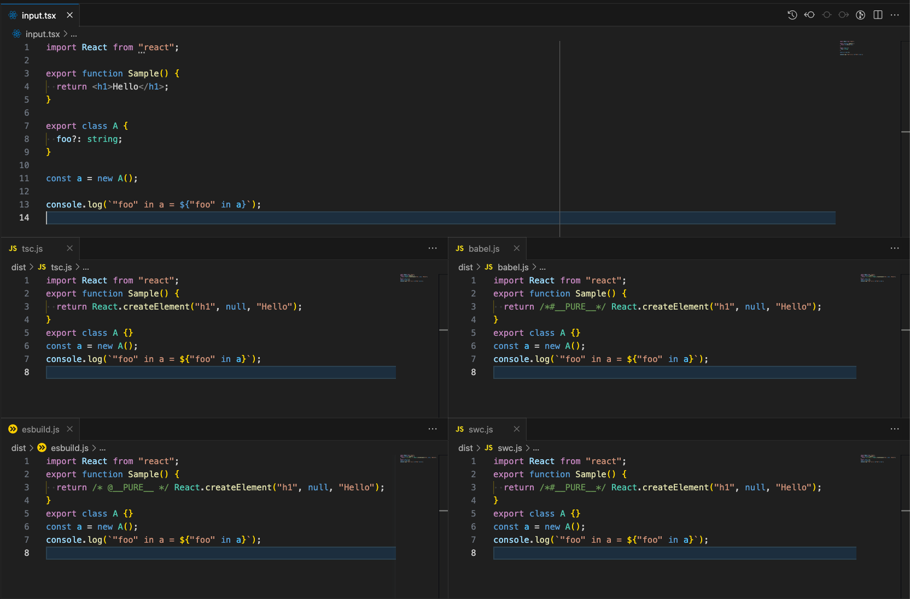

# ts-compiler-comparison

This is a repository to compare how TypeScript and JSX are compiled by tsc (TypeScript Compiler), Babel, esbuild, and SWC.

By comparing the differences in output depending on the settings and versions of each tool, you can use this information to support smooth tool migration and related tool development.

## Usage

`npm install`

`npm run build`: input.tsx -> dist/

- Compile input.tsx using the CLI version of each tool and output to the dist directory
- For ease of reading, it is formatted in Prettier afterwards.

